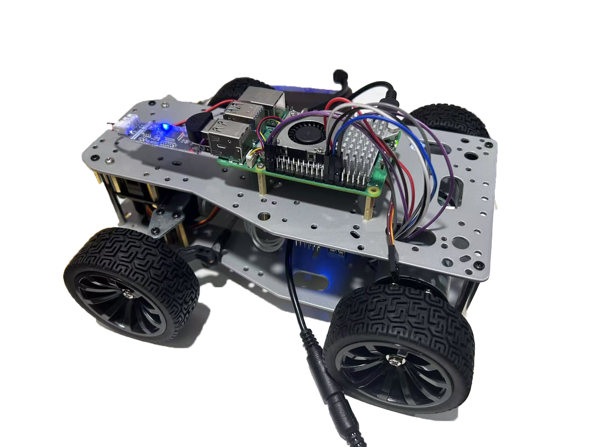

# RoboHospitalGuide: Smart Hospital Guide Robot



[CHN Version](README_CN.md)  

[Process Identification](ProcessIdentification.md)

## 🩺 Project Overview
RoboHospitalGuide is an intelligent hospital guide robot system developed on Raspberry Pi 5B. This system is designed to enhance the hospital experience by offering autonomous navigation, facial recognition, and patient guidance services. Integrated with a graphical user interface (GUI) and real-time hardware control, this project showcases a modular and scalable architecture suitable for real-world hospital deployments.

The robot navigates patients to their assigned departments using face recognition and hospital database lookup, while dynamically avoiding obstacles and playing guiding audio instructions. The system is structured with a multithreaded backend and a Qt6-based GUI frontend.

## 🎯 Key Features

### 🔐 Facial Recognition
- Uses OpenCV and a custom-trained recognizer to identify patients.
- Matches patient face data against preloaded database images.
- GUI provides live face detection feedback.

### 🧭 Autonomous Navigation
- Loads department destination from GUI input or recognition match.
- Navigates using predefined map paths loaded from JSON.
- Controls four-wheel drive and direction with GPIO and PWM.

### 🚧 Obstacle Avoidance
- Equipped with ultrasonic sensors to detect and bypass dynamic obstacles.
- Navigation pauses and resumes automatically based on sensor feedback.

### 🧠 Intelligent Motion Control
- Incorporates gyroscope (MPU6050) for motion stability.
- Real-time yaw correction for precise turns and path tracking.

### 🗣️ Audio Feedback
- Plays pre-recorded audio during navigation: start, hold, stop.
- Future support for voice interaction and dynamic audio response.

### 🖥️ Qt6 GUI Interface
- Modern UI built with Qt6 (Widgets + Designer).
- Allows manual patient input, command triggers, and status viewing.
- Displays recognition results, navigation status, and debug logs.

## 🧱 Hardware Requirements
| Component | Purpose |
|----------|---------|
| Raspberry Pi 5B | Main control board |
| Camera Module | Face recognition |
| Ultrasonic Sensors | Obstacle detection |
| Gyroscope (MPU6050) | Orientation and yaw feedback |
| Motor Driver (L298N) | Drive control for 4WD chassis |
| 4WD Robot Chassis | Robot mobility |
| Rechargeable Battery | Power source |
| Optional: Touchscreen | GUI display (or remote access via VNC) |

## 📎 GPIO/SPI/I2C Wiring Diagram

```
+---------------------+-------------------------+----------------+
| Device              | Raspberry Pi GPIO Pin   | Notes          |
+---------------------+-------------------------+----------------+
| Ultrasonic Trigger  | GPIO17 (Pin 11)         | Output         |
| Ultrasonic Echo     | GPIO27 (Pin 13)         | Input          |
| MPU6050 SCL         | GPIO3  (Pin 5 - I2C)    | I2C Clock      |
| MPU6050 SDA         | GPIO2  (Pin 3 - I2C)    | I2C Data       |
| Motor IN1           | GPIO16 (Pin 36)         | Motor L298N    |
| Motor IN2           | GPIO20 (Pin 38)         | Motor L298N    |
| Motor IN3           | GPIO21 (Pin 40)         | Motor L298N    |
| Motor IN4           | GPIO26 (Pin 37)         | Motor L298N    |
| Servo (Yaw)         | GPIO18 (Pin 12 - PWM)   | PWM Control    |
| Camera              | CSI Port                | Face Capture   |
+---------------------+-------------------------+----------------+
```

> ⚠️ Ensure I2C and SPI are enabled using `sudo raspi-config > Interface Options`.

## 🧱 Software Dependencies & Qt Configuration

### ✅ Required Libraries
- Qt6 Core, Widgets, SVG, Network, Sql, Xml
- OpenCV 4.x
- libgpiod (GPIO control)
- WiringPi or alternatives (optional)
- ALSA or MPlayer (for audio playback)

### ✅ Install Qt6 (using Qt Online Installer)
- Select "Embedded ARM 64-bit" or compile for desktop ARM64
- Include: Qt6 Core, Widgets, Designer, SvgWidgets, Sql, Network

### ✅ Install OpenCV
```bash
sudo apt install libopencv-dev libopencv-core-dev
```

### ✅ Install libgpiod
```bash
sudo apt install libgpiod-dev gpiod
```

### ✅ Enable I2C and SPI
```bash
sudo raspi-config
# Enable Interface Options > I2C, SPI
```

## 🗂️ Project Structure
```
include/            # C++ headers
├── core/           # Core logic (face recognition, navigation)
├── drivers/        # Hardware abstraction
│   └── hal/        # HAL (e.g., GPIO, motor, MPU)
├── utils/          # Helpers

src/                # C++ source files
├── core/
├── drivers/
│   └── hal/
├── utils/

RobotGUI/           # Qt6 GUI frontend (mainwindow, signals, slots)
config/             # Config files (nav.json, hospital_map.svg, etc.)
docs/               # Documentation
├── design/         # Design assets
└── api/            # (Planned) API specifications

scripts/            # Build or test scripts
tests/              # Unit and integration tests
third_party/        # External libs (if any)
build/              # Build output folder (ignored in repo)
```

## 🚀 Installation & Running
### Prerequisites
- Raspberry Pi OS (64-bit)
- Qt 6.5+ installed (via Qt Online Installer)
- OpenCV 4.x installed
- CMake + g++ 10+
- GPIOD + ALSA

### Building the project
```bash
git clone https://github.com/yourname/RoboHospitalGuide.git
cd RoboHospitalGuide
mkdir build && cd build
cmake ..
make -j4
```

### Running
```bash
./RoboHospitalGuide -platform xcb   # Or eglfs for embedded devices
```

## 🧩 Future Roadmap
| Version | Planned Features |
|---------|------------------|
| v1.1 | Voice guidance, basic voice interaction |
| v1.2 | Remote control panel for doctor override |
| v2.0 | AI-enhanced path planning, cloud database integration |
| v2.1 | Patient queue management, multilingual support |

## 📜 License
MIT License (or your preferred license)

## 👨‍💻 Contributors
- [aurora0543](https://github.com/aurora0543)
- [EricZJ](https://github.com/323417)
- [zz117zz](https://github.com/zz117zz)
- [Wswwhcs4](https://github.com/Wswwhcs4) 

---
Feel free to open issues or submit pull requests for improvements!

